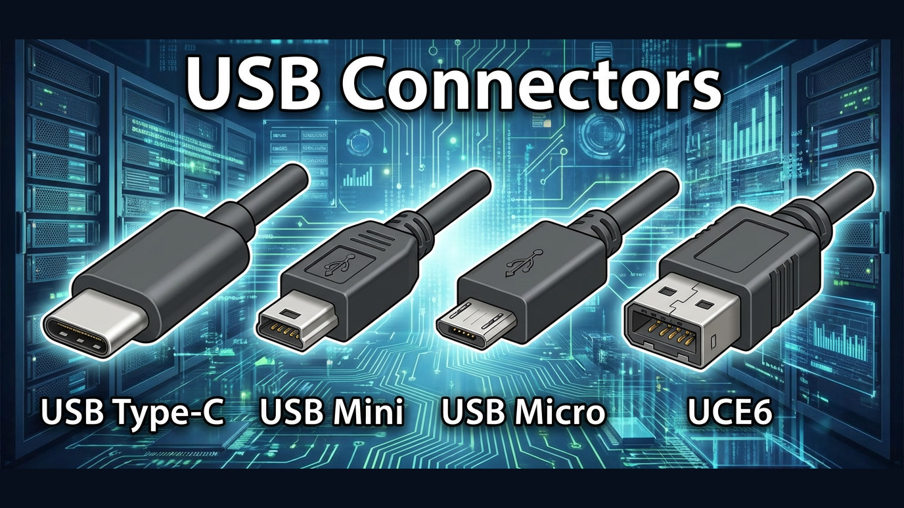

# Cable Reference Wall Charts

Printable wall posters for quick cable and connector identification.

Generated with Nano Banana Pro.

## Contents

- **Display Connectors** - HDMI, DisplayPort, DVI, VGA
- **HDMI Cables** - Regular, Mini, and Micro HDMI types
- **Desktop USB Connections** - USB Type A, B, and C
- **USB Phone Connections** - Type-C, Mini, Micro USB
- **IEC Connectors** - Power cable connector types (C5, C6, C7, C13, C14)

## Formats

Each chart is available as PNG and PDF. Combined posters are also included in landscape and portrait layouts.
